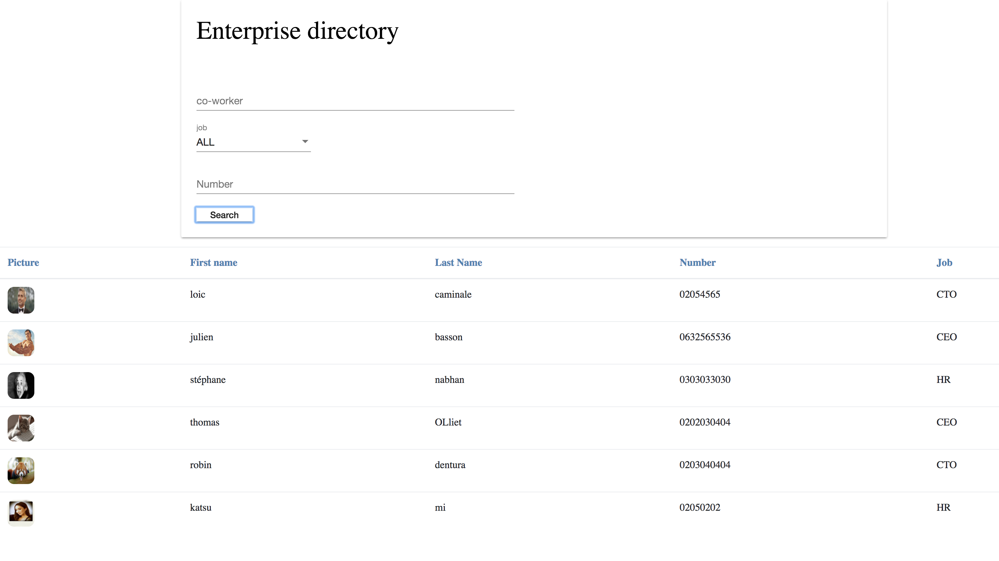

# Angular 2 / Search Engine

# Contents
* [overview](#overview)
* [results](#results)
* [intallation](#intallation)


# overview

-This project is an Enterprise directory with autocomplete fields for name and phone number
where we can find and see the details about your co-workers.
The directory has a registration and authentification sytem (provided by Meteor), to add new co-worker to the directory.

# results




# intallation
## for client side :
```
cd <your-path/client> 
npm i
```
if you have angular installed in global :
```
ng build && ng serve

```
else, just launch the app by :
```
npm run build && npm run serve
```
## for server side :
```
git clone https://github.com/BlackStef/meteor_search_engine.git
npm i
meteor run 
```
